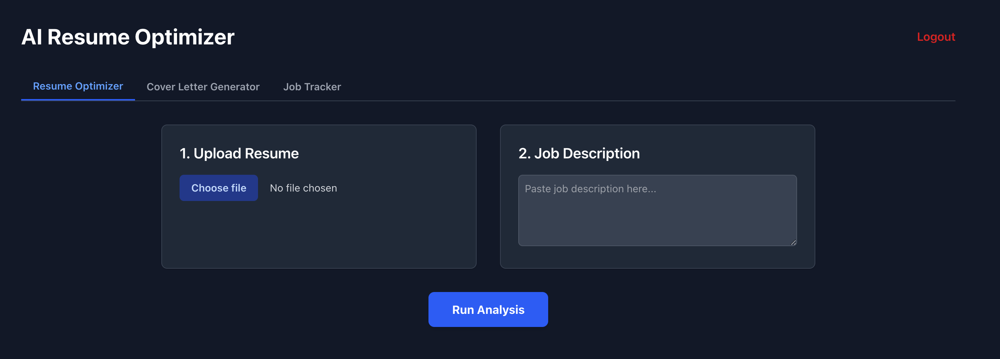
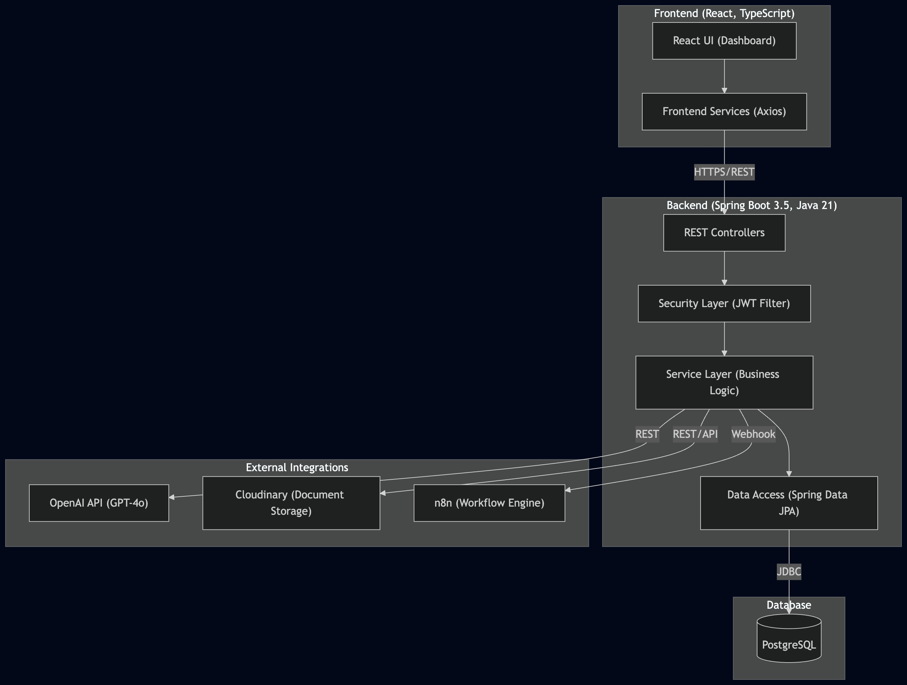
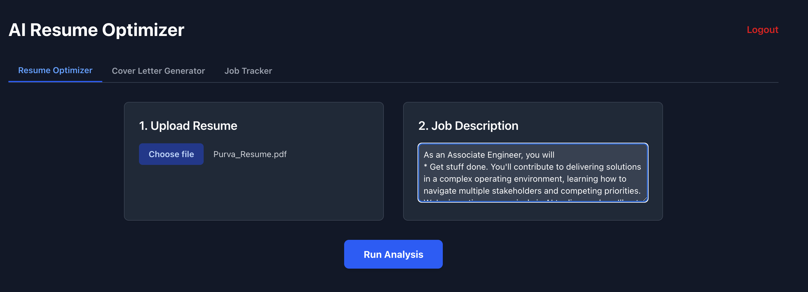
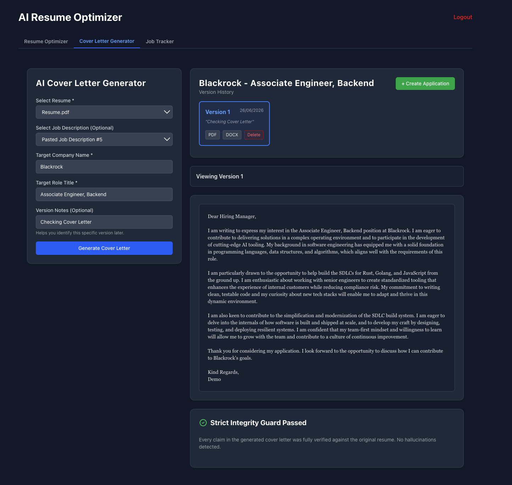
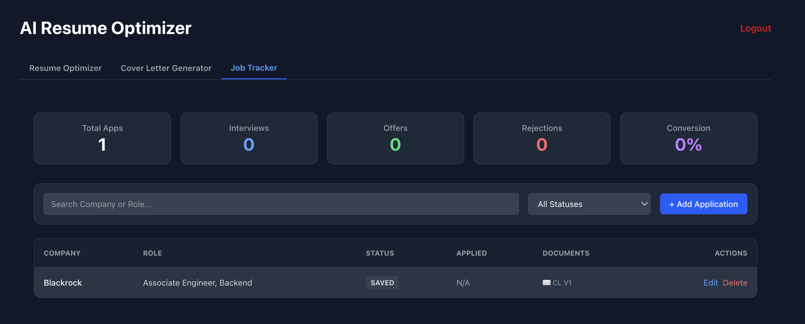
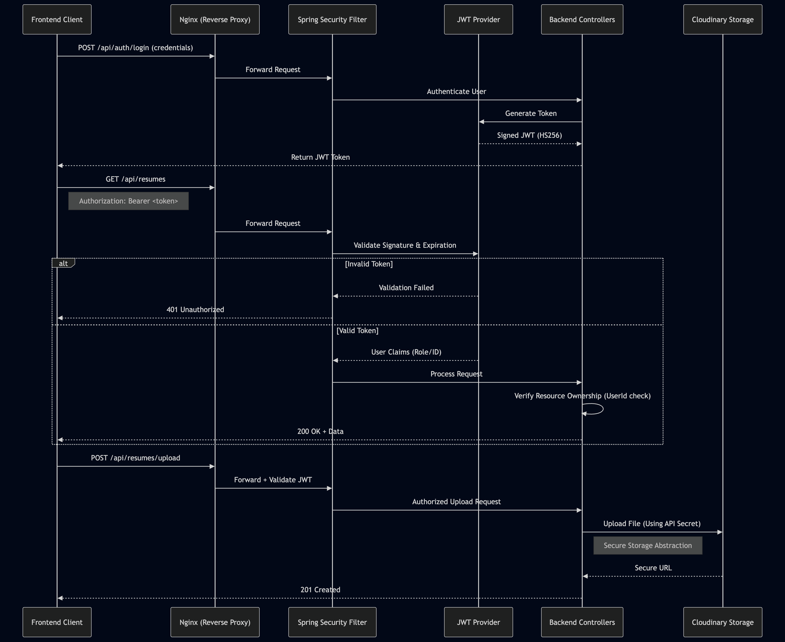

<div align="center">
  <h1>Resume Analysis and Optimisation Engine</h1>
  <p>A production-grade platform for resume optimisation, AI-assisted document generation, workflow automation, and application lifecycle tracking.</p>

  
  
  
  
  
  
</div>

---

## 🌐 Live Demo & Documentation

| Resource | Link |
| :--- | :--- |
| **Live Application** | [https://resume-optimizer.demo.com](https://resume-optimizer.demo.com) *(Placeholder)* |
| **Swagger API Docs** | [https://api.resume-optimizer.demo.com/swagger-ui.html](https://api.resume-optimizer.demo.com/swagger-ui.html) *(Placeholder)* |
| **AWS Deployment** | Managed via GitHub Actions |

---

## 📸 Screenshots & Demo

*(Add Demo Video Link Here)*

| Dashboard | Resume Optimizer | Cover Letter Generator |
| :---: | :---: | :---: |
|  |  |  |

| Version History | Job Tracker | Analytics |
| :---: | :---: | :---: |
|  |  |  |

*(Note: Replace placeholder image paths with actual screenshots)*

---

## 💡 Why I Built This

Most AI resume optimization tools on the market suffer from a fatal flaw: **Hallucination**. They invent experiences, fabricate metrics and hallucinate technologies to achieve a 100% ATS keyword match. 

**Recruiters and Engineering Managers care about factual accuracy above all else.**

I built this platform around a philosophy of **"95% Truthfulness, 5% Tailoring"**. To enforce this mechanically, I engineered a **Traceability Guard**—a strict backend validation pipeline that forces the AI (GPT-4o) to map every single generated bullet point directly back to the original source resume. If the system detects fabricated data, the optimization is rejected and blocked from export. 

This project aims to provide *trustworthy* AI-assisted optimization, not blind AI rewriting.

---

## 🚀 Platform Capabilities

- ✓ **6-domain AI traceability validation engine**
- ✓ **ATS analysis and keyword gap detection**
- ✓ **Resume optimisation with integrity validation**
- ✓ **Versioned cover letter management**
- ✓ **Diff-based version comparison**
- ✓ **Application tracking and analytics**
- ✓ **AWS deployment (EC2, RDS, S3, ECR)**
- ✓ **GitHub Actions CI/CD pipeline**
- ✓ **Prometheus & Grafana observability**
- ✓ **PDF and DOCX export**

---

## 🏗️ Architecture Summary

| Layer | Technologies |
| --- | --- |
| **Frontend** | React 19, TypeScript, Tailwind CSS, Vite |
| **Backend** | Java 21, Spring Boot 3.5 (Web, Security, Data JPA, Validation) |
| **Database** | PostgreSQL 16, Flyway (Migrations) |
| **AI** | OpenAI GPT-4o API |
| **Workflow** | n8n |
| **Cloud** | AWS EC2 (Compute), RDS (Database), S3 (Storage), ECR (Registry) |
| **Monitoring** | Prometheus, Grafana, Micrometer, Spring Boot Actuator |
| **Security** | JWT (HS256), Spring Security |

## 🛠️ Engineering Highlights

- **Stateless JWT Authentication** for decoupled frontend-backend communication.
- **PostgreSQL JSONB Modelling** to store unstructured AI generation history alongside structured relational data.
- **OpenAI GPT-4o Integration** using deterministic prompt engineering for ATS optimization.
- **n8n Workflow Orchestration** for asynchronous webhook-based automation.
- **AWS S3 Document Storage** via IAM roles, keeping the database lean and binary-free.
- **Versioned Document Generation** utilizing a 1:N relational model and React Diff Viewer.
- **Structured Logging** with injected Correlation UUIDs via custom MDC servlet filters.
- **Prometheus & Grafana Monitoring** exposing Actuator and Micrometer metrics for JVM, HTTP, and connection pools.
- **GitHub Actions CI/CD** automating builds and testing prior to deployment.
- **Cloud Storage Abstraction** supporting multiple providers (AWS S3, Cloudinary) via a `StorageService` interface.

---

## ⚙️ Engineering Decisions

Building a production-ready platform requires intentional trade-offs. Here is the rationale behind my core architectural choices:

1. **Why PostgreSQL + JSONB?**
   While MongoDB is popular for document generation, I chose PostgreSQL. Resumes and Applications are highly relational, but the generated AI responses (Traceability Data, Gap Analysis) are unstructured. PostgreSQL's JSONB columns gave me the strict ACID compliance needed for user relationships, with the schema flexibility needed for evolving LLM JSON outputs.
2. **Why AWS S3 instead of Database BLOB storage?**
   Storing raw PDFs as `bytea` in PostgreSQL bloats the database size rapidly, hurting cache hit ratios and increasing RDS costs. Offloading binary files to a private S3 bucket keeps the database lean and allows for pre-signed URLs if direct client downloads are needed later.
3. **Why Versioned Cover Letters?**
   Initial user testing revealed that users wanted to tweak cover letters without losing previous generations. Instead of overwriting (1:1), I implemented a 1:N relational model (`CoverLetter` -> `CoverLetterVersion`) with a React Diff Viewer so users can track changes iteratively.
4. **Why Prometheus + Grafana over CloudWatch?**
   While CloudWatch is easy to set up, integrating Micrometer with Prometheus allowed me to expose deep JVM metrics (Garbage Collection pauses) and HikariCP database connection pool metrics locally during development, ensuring the app was hardened *before* cloud deployment.
5. **Why JWT Authentication?**
   To support a decoupled React frontend and potential future mobile clients, stateful session cookies were avoided. JWTs provide a stateless, easily scalable security model, validated via a custom Spring Security filter on every request.

---

## 🗺️ System Workflows & Architecture

### System Architecture
The application follows a modular monolith architecture with clearly separated frontend, backend, workflow, storage, and AI integration layers.


### 1. Resume Optimization Workflow
The core feature involves strict deterministic validation against the source document.


### 2. Cover Letter Workflow
Every generation creates an immutable snapshot.


### 3. Job Tracker Workflow
Tight integration allows 1-click application tracking right from the document generation screens.


---

## 📊 Observability & Monitoring

The platform is instrumented for "Day 2" operations using Spring Boot Actuator, Micrometer, Prometheus, and Grafana.

- **Business Metrics**: Custom `Counter` beans track `resume.generations.count` and `jobapplication.creations.count`.
- **System Metrics**: Automatically exports JVM Memory, GC times, HTTP request latency percentiles, and HikariCP connection pool health.
- **Structured Logging**: A custom `RequestLoggingFilter` injects a unique UUID (`requestId`) into the MDC (Mapped Diagnostic Context) for every request, allowing easy cross-referencing in log aggregators.
- **Health Indicators**: Custom `HealthIndicator` beans actively poll AWS S3, OpenAI, and n8n to provide real-time dependency status on the `/health` endpoint.

---

## 🛡️ Security Architecture

Security is built-in at the framework layer using Spring Security.

- **Authentication**: Stateless HS256 signed JWT tokens.
- **Authorization**: Hardened ownership verification ensures `User A` cannot query the database for `User B`'s documents (IDOR protection).
- **Data Validation**: Strict `@Valid` Jakarta bean validation on all incoming REST payloads.
- **Global Error Handling**: A `@ControllerAdvice` global exception handler standardizes all errors into clean JSON, ensuring internal stack traces never leak to the frontend.



---

## ☁️ Deployment Architecture

The application is built with a flexible, provider-agnostic deployment strategy in mind. 

### Supported Production Architecture
The platform was fundamentally architected to support enterprise-grade AWS infrastructure:
- **Compute**: AWS EC2 orchestrated via Docker Compose & Nginx.
- **Database**: AWS RDS (PostgreSQL).
- **Storage**: AWS S3 (via `S3StorageService`).
- **Observability**: AWS CloudWatch (`awslogs` driver).


### Current Live Hosting Environment
For the live portfolio demonstration, the application is deployed on a modern, free-tier optimized stack:
- **Frontend Hosting**: Vercel (Auto-deploy via GitHub Actions).
- **Backend Hosting**: Render Web Service (Spring Boot 3.5).
- **Database**: Neon PostgreSQL (Serverless PostgreSQL).
- **File Storage**: Cloudinary (via `CloudinaryStorageService`).
- **Observability**: Render Logs, Actuator, Prometheus, and Grafana.

This dual-target capability is achieved by an abstract `StorageService` interface and Spring Boot Profiles, allowing seamless switching between environments without altering domain logic.

---

## 🔌 API Overview

The backend exposes a comprehensive RESTful API. For the complete OpenAPI specification and interactive testing environment, visit `/swagger-ui.html`.

| Module | Responsibility | Example Endpoints |
|----------|----------|----------|
| **Authentication** | User registration, login, JWT issuance | `/api/auth/register`, `/api/auth/login` |
| **Resume Management** | Resume upload, parsing, storage, export | `/api/resumes/upload`, `/api/resumes/{id}/export/pdf` |
| **Resume Analysis** | ATS scoring, keyword gap analysis, optimisation workflows | `/api/resumes/{id}/analyze`, `/api/resumes/{id}/optimize` |
| **Cover Letter Management** | Cover letter generation, version history, exports | `/api/cover-letters`, `/api/cover-letters/{id}/versions` |
| **Job Tracker** | Application lifecycle tracking, status updates, analytics | `/api/job-applications` |
| **Monitoring & Health** | Platform health checks and metrics | `/actuator/health`, `/actuator/prometheus` |

### API Documentation

Swagger UI is available at:

```text
/swagger-ui.html
---

## 💻 Local Development Setup

### Prerequisites
- Java 21
- Node.js 20+
- Docker & Docker Compose
- AWS Account (S3 Bucket & IAM Keys)
- OpenAI API Key

### Running Locally
1. **Clone the repo**
   ```bash
   git clone https://github.com/yourusername/ai-resume-optimizer.git
   ```
2. **Environment Variables**
   Create a `.env` file in the root directory:
   ```env
   POSTGRES_USER=resumeoptimizer
   POSTGRES_PASSWORD=your_password
   JWT_SECRET=your_super_secret_jwt_key
   OPENAI_API_KEY=sk-your-key
   ```
3. **Boot Infrastructure** (PostgreSQL, n8n, MailHog)
   ```bash
   docker compose up -d
   ```
4. **Start Backend**
   ```bash
   cd backend
   ./mvnw spring-boot:run
   ```
5. **Start Frontend**
   ```bash
   cd frontend
   npm install
   npm run dev
   ```

---

## 📈 Lessons Learned

1. **AI Validation & Prompt Engineering**: I learned that you cannot trust an LLM to police itself. Even with zero-temperature prompting, GPT-4o will occasionally hallucinate to hit 100% ATS matches. Building a backend validation engine (the Traceability Guard) taught me how to strictly enforce deterministic outcomes on non-deterministic models.
2. **Versioning Strategies**: Moving from a simple 1:1 Cover Letter model to an immutable 1:N Versioning system taught me how to manage complex Hibernate cascade types and lazy loading without impacting performance.
3. **AWS Deployment & Cloud Native Design**: Offloading binary documents to an S3 bucket instead of using PostgreSQL `bytea` columns drastically improved cache hit ratios and reduced RDS costs, underscoring the importance of cloud-native data modeling.
4. **Observability**: Adding Micrometer and Grafana wasn't just "for show." It directly helped me debug slow database queries during load testing by surfacing HikariCP pool exhaustion—a problem I wouldn't have caught with basic console logs.
5. **Security & JWTs**: Implementing stateless JWT authentication with Spring Security and custom MDC logging filters taught me how to build secure, auditable APIs ready for enterprise deployment.
6. **Workflow Automation**: Integrating n8n via webhooks provided hands-on experience orchestrating external asynchronous workflows outside the core Spring Boot application context.

---

## 🎯 Project Outcomes

This project demonstrates practical experience across:

- Backend Engineering
- Cloud Engineering
- AI Integration
- Workflow Automation
- Security Engineering
- Observability
- DevOps & CI/CD
- System Design

The platform was intentionally designed to resemble a production-grade engineering system rather than a proof-of-concept AI application.

---

## 🔮 Future Enhancements

- Redis caching layer for frequently requested ATS analyses
- Event-driven document processing using Kafka
- Real-time progress updates via Server-Sent Events (SSE)
- AI-assisted interview preparation workflows
- Advanced recruiter and application analytics

---

## 🏷️ Repository Topics
If you are forking this repository, consider adding these topics to your GitHub project settings to improve discoverability:

`java` `java21` `spring-boot` `spring-security` `postgresql` `react` `typescript` `openai` `gpt4o` `n8n` `docker` `aws` `aws-s3` `aws-rds` `aws-ec2` `aws-ecr` `github-actions` `jwt` `prometheus` `grafana` `micrometer` `resume-optimizer` `ats` `cover-letter-generator` `workflow-automation` `backend-engineering`

---

## 📄 License
This project is licensed under the MIT License - see the LICENSE file for details.

---

## ✉️ Contact Information

**Purva Thota**
- 💼 [LinkedIn](https://www.linkedin.com/in/purva-thota/)
- 🌐 [Portfolio](https://yourportfolio.com)
- 📧 [Email](mailto:[purvathota@gmail.com])

